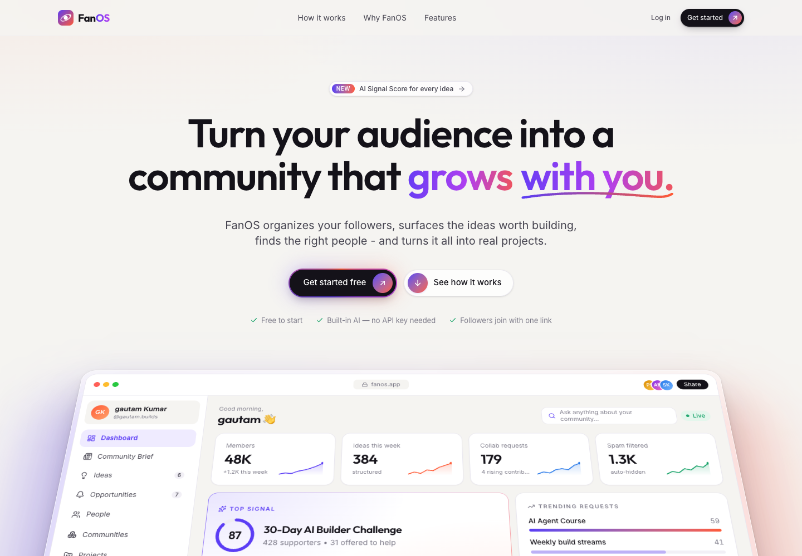
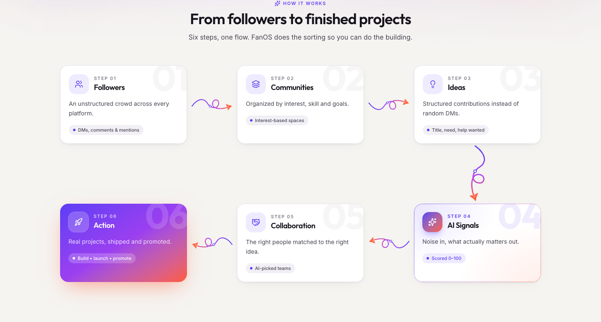
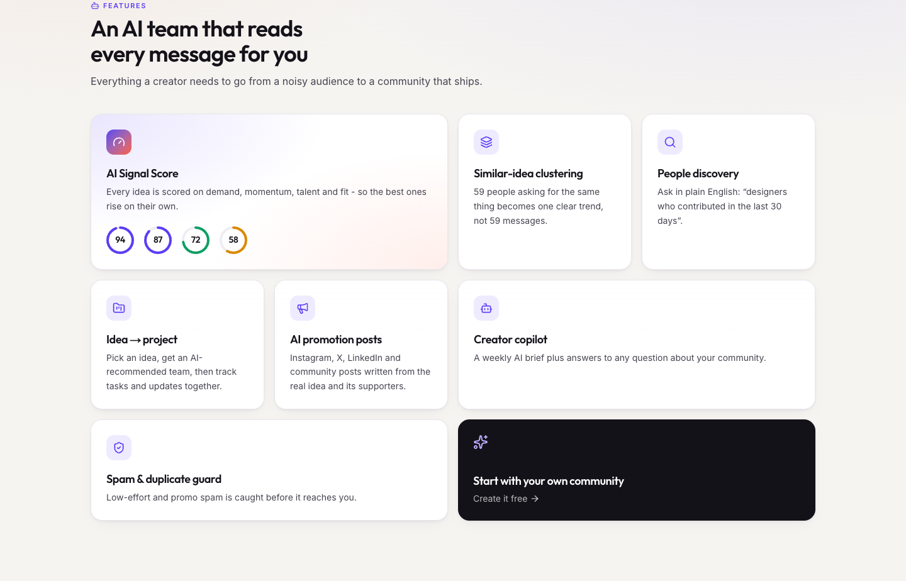
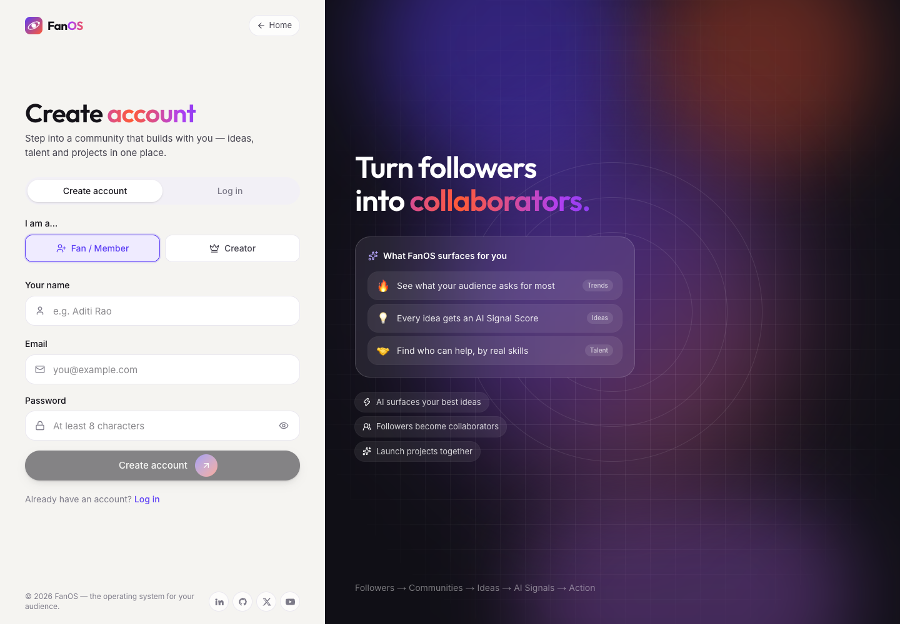
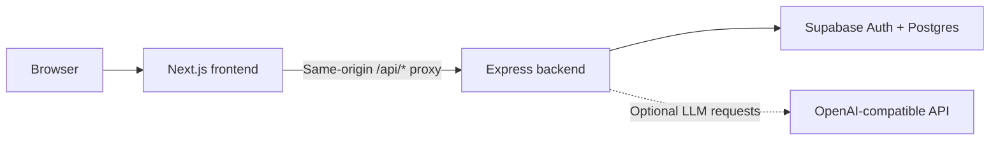

<div align="center">

# FanOS

### The operating system for your audience

Turn community ideas into collaborative projects—with the people, signals, and tools to move them forward.

[](frontend/package.json)
[](frontend/package.json)
[](backend/package.json)
[](backend/supabase/migrations/001_fanos.sql)
[](frontend/package.json)

[Overview](#overview) · [Screenshots](#screenshots) · [Getting started](#getting-started) · [Architecture](#architecture) · [Deployment](#deployment)



</div>

## Overview

Great ideas and potential collaborators are easy to lose in comments and direct messages. FanOS gives creators a dedicated place to organize their audience, collect structured ideas, identify useful signals, and build with their community.

**Followers → Communities → Ideas → AI Signals → Collaboration → Action**

Creators manage communities, review ideas, discover contributors, and launch projects. Members join interest-based spaces, share suggestions, support ideas, and contribute their skills.

Accounts and community content are stored in Supabase. New communities start empty; the public landing page includes an explicitly labelled dashboard illustration with sample values.

## Screenshots

These captures show the actual locally rendered public interface. The dashboard visible in the landing-page hero is a product illustration with sample data, rather than an authenticated community.

| Community workflow | Product capabilities |
| :---: | :---: |
|  |  |

<details>
<summary><strong>View account registration</strong></summary>



</details>

Capture details and refresh instructions are in [docs/screenshots/README.md](docs/screenshots/README.md).

## Features

| Area | Capabilities |
| --- | --- |
| **Communities** | Creator setup, member onboarding, interest-based spaces, feeds, and community membership. |
| **Ideas** | Structured submissions, support, comments, volunteer participation, and duplicate/spam checks. |
| **People** | Contributor profiles, Contribution Scores, and discovery by skills and interests. |
| **AI signals** | Idea summaries, similar-idea clustering, trending topics, Signal Scores, and weekly briefs. |
| **Collaboration** | Select ideas for pilots, assign owners and contributors, and track project tasks and updates. |
| **Promotion** | Feature ideas, share public idea pages, and draft posts for Instagram, X, LinkedIn, and the community. |
| **Creator copilot** | Ask questions about community activity; optionally enable LLM-generated responses. |

The built-in analysis engine works without an external AI key. An optional backend LLM integration adds richer summaries, copilot answers, and promotion copy.

### From idea to execution

```text
Submitted → Discussing → Selected → In progress → Completed
                 ↘ Archived (when no project is attached)
```

- **Submitted:** a member shares an idea.
- **Discussing:** someone comments or volunteers to help.
- **Selected:** the creator selects the idea for a pilot.
- **In progress:** the creator creates a project workspace.
- **Completed:** the creator or project owner marks the project complete.

The lifecycle is derived from stored idea and project data. Each idea also has an Action Brief covering community evidence, available contributors, missing skills, and the next practical step. Creators can archive and restore eligible ideas.

## Getting started

### Prerequisites

- **Node.js 22 or later** and npm.
- A **Supabase project** for authentication and persistent community data.
- An optional OpenAI-compatible API key for LLM features.

Run the commands below from the repository root—the directory containing `frontend/` and `backend/`.

### 1. Install dependencies

```bash
cd backend
npm ci
cd ../frontend
npm ci
cd ..
```

### 2. Configure the environment

```bash
cp backend/.env.example backend/.env
cp frontend/.env.example frontend/.env.local
```

In `backend/.env`, replace the placeholder values for `SUPABASE_URL`, `SUPABASE_PUBLISHABLE_KEY`, and `SUPABASE_SECRET_KEY`. Keep `frontend/.env.local` pointed at your local API:

```dotenv
BACKEND_URL=http://localhost:4000
```

### 3. Initialize Supabase

In your project's **Supabase SQL Editor**, run [backend/supabase/migrations/001_fanos.sql](backend/supabase/migrations/001_fanos.sql).

The migration creates `profiles` for user roles, `app_state` for versioned community data, and `creator_feedback` for the legacy feedback endpoint. Row Level Security is enabled; database access is handled by the backend.

### 4. Start both services

In one terminal:

```bash
cd backend
npm run dev
```

In a second terminal:

```bash
cd frontend
npm run dev
```

Open **http://localhost:3000**. The API runs at **http://localhost:4000**; its health endpoint is **http://localhost:4000/health**.

### 5. Create your community

1. Register as a **Creator** and complete the creator profile. The first creator account claims the community; subsequent creator registrations require the configured access code.
2. Share the dashboard's member join link: `<frontend-url>/join` (the older `/?join=1` still works).
3. Members register, complete onboarding, and join communities.
4. Review submissions, select an idea, and create a project with an owner, contributors, and tasks.

## Configuration

### Backend — `backend/.env`

| Variable | Required | Purpose |
| --- | :---: | --- |
| `SUPABASE_URL` | Yes | Supabase project URL. |
| `SUPABASE_PUBLISHABLE_KEY` | Yes | Publishable key used for authentication. |
| `SUPABASE_SECRET_KEY` | Yes | Server-only key for database access and auth administration. |
| `PORT` | No | API port; defaults to `4000`. |
| `CREATOR_ACCESS_CODE` | No | Enables additional creator registrations after the first account. |
| `OPENAI_API_KEY` | No | Enables optional LLM features. |
| `OPENAI_MODEL` | No | Overrides the backend's default model. |
| `OPENAI_BASE_URL` | No | Points LLM requests at an OpenAI-compatible endpoint. |
| `FEEDBACK_ADMIN_TOKEN` | No | Admin access to legacy creator feedback. |
| `SUPABASE_ACCESS_TOKEN` | No | Supabase CLI token; not required by the application runtime. |

### Frontend — `frontend/.env.local`

| Variable | Required | Purpose |
| --- | :---: | --- |
| `BACKEND_URL` | Yes for deployment | API base URL, without a trailing slash. Defaults to `http://localhost:4000` in the Next.js config. Rebuild/redeploy after changing it. |

Environment files are git-ignored. Commit only placeholder `.env.example` files; keep Supabase secret keys and LLM keys on the backend.

## Architecture



- **Frontend:** Next.js 16, React 19, Tailwind CSS 4, and Lucide icons. Handles role-based navigation, UI state, optimistic updates, and built-in analysis.
- **Backend:** Express 5 with Supabase clients. Handles authentication, authorization, validation, persistence, and optional LLM requests.
- **Persistence:** accounts live in Supabase Auth and `profiles`. Community content lives in a versioned JSONB document in `app_state`, with optimistic concurrency checks and retries.
- **API proxy:** `frontend/next.config.mjs` forwards relative `/api/*` requests to `BACKEND_URL`, keeping browser requests and session cookies on the frontend origin.
- **Shared logic:** `frontend/app/lib/{reducer,ai,seed}.js` is the source for the backend copies in `backend/src/shared/`.

### Project structure

```text
.
├── frontend/
│   ├── app/
│   │   ├── [[...slug]]/page.js   # Application route entry
│   │   ├── components/          # Landing, auth, creator, and member UI
│   │   ├── lib/                 # Store, routing, reducer, and analysis
│   │   ├── globals.css
│   │   └── layout.js
│   ├── public/                 # Static assets
│   └── next.config.mjs         # API proxy configuration
├── backend/
│   ├── src/
│   │   ├── app.js              # Express middleware and routes
│   │   ├── server.js           # API entry point
│   │   ├── routes/             # Auth, community, AI, public, feedback
│   │   ├── lib/                # Validation, auth, persistence, and LLM
│   │   └── shared/             # Copies of shared frontend logic
│   ├── scripts/sync-shared.mjs
│   ├── supabase/migrations/    # Database schema
│   └── Dockerfile
├── docs/screenshots/           # README screenshots
└── README.md
```

### Key API endpoints

| Method | Path | Purpose |
| --- | --- | --- |
| `GET` | `/health` | Service health check. |
| `POST` | `/api/auth/signup`, `/api/auth/login`, `/api/auth/logout` | Account and session operations. |
| `GET` | `/api/auth/me` | Current signed-in user. |
| `GET` | `/api/state` | Community state for the authenticated user. |
| `POST` | `/api/actions` | Authorized, validated state changes. |
| `GET`, `POST` | `/api/ai` | LLM availability and optional generation. |
| `GET` | `/api/public/ideas/:id` | Public data for a featured, unarchived idea. |
| `GET`, `POST` | `/api/feedback` | Legacy creator feedback operations. |

### Application routes

| Routes | Audience |
| --- | --- |
| `/` | Public landing page. |
| `/auth/login`, `/auth/signup` | Account access. |
| `/setup` | Creator profile setup. |
| `/onboarding` | Member onboarding. |
| `/dashboard`, `/brief`, `/opportunities` | Creator views. |
| `/home`, `/profile` | Member views. |
| `/ideas`, `/people`, `/communities`, `/projects` | Creator and member views, adapted to role. |
| `/communities/:id`, `/projects/:id` | Community and project details. |
| `/i/:id` | Public featured idea page. |

Protected pages send signed-out visitors to login. Role-specific pages redirect users to their appropriate home. The member invitation URL `/join` (or the older `/?join=1`) opens member registration with a preview of the community.

## Development

| Directory | Command | Purpose |
| --- | --- | --- |
| `frontend/` | `npm run dev` | Start the frontend development server. |
| `frontend/` | `npm run lint` | Run ESLint. |
| `frontend/` | `npm run build` | Build the production frontend. |
| `frontend/` | `npm start` | Serve a completed production build. |
| `backend/` | `npm run dev` | Run the API with Node's watch mode. |
| `backend/` | `npm start` | Start the API. |
| `backend/` | `npm run sync-shared` | Refresh backend copies of shared frontend logic. |

After changing the shared reducer, analysis engine, or configuration in `frontend/app/lib/`, run `npm run sync-shared` from `backend/` and include the generated changes in your contribution.

## Deployment

Initialize the Supabase schema before using the deployed application, then deploy the backend and frontend as separate services.

| Setting | Backend | Frontend |
| --- | --- | --- |
| Root directory | `backend` | `frontend` |
| Install | `npm ci` | `npm ci` |
| Build | None; or use the included Dockerfile | `npm run build` |
| Start | `npm start` | `npm start`, or the host's Next.js integration |
| Configuration | Supabase keys and optional LLM settings | `BACKEND_URL` set to the deployed API URL |
| Health check | `/health` | `/` |

The frontend can run on a Next.js-capable host; the backend needs a Node.js 22+ or Docker host. After deployment, verify login and member registration through the frontend URL, then share `<frontend-url>/join` (the older `/?join=1` still works).

## Troubleshooting

| Symptom | Check |
| --- | --- |
| “Supabase is not configured” | Set all three required Supabase values in `backend/.env` and restart the API. |
| “Database tables are missing” | Run the SQL migration in the correct Supabase project. |
| Frontend API requests fail | Confirm the backend is running and `BACKEND_URL` matches its address; rebuild after production configuration changes. |
| Additional creator registration is blocked | Configure `CREATOR_ACCESS_CODE` on the backend. |
| LLM generation is unavailable | Check the optional API key, model, and base URL. Built-in analysis remains available without an LLM key. |

## Security and current limitations

Authentication uses Supabase sessions in HTTP-only cookies. The backend validates actions against allow-lists and derives identities from the session. Database tables have RLS enabled with no public policies; access uses the backend's server-only secret key. Public idea endpoints expose selected fields and abbreviated member names.

Email sign-ups are currently pre-confirmed, and a password reset UI is not implemented. Community content currently uses a shared JSONB document; normalized tables and embedding-based search are possible future improvements, rather than existing features.
